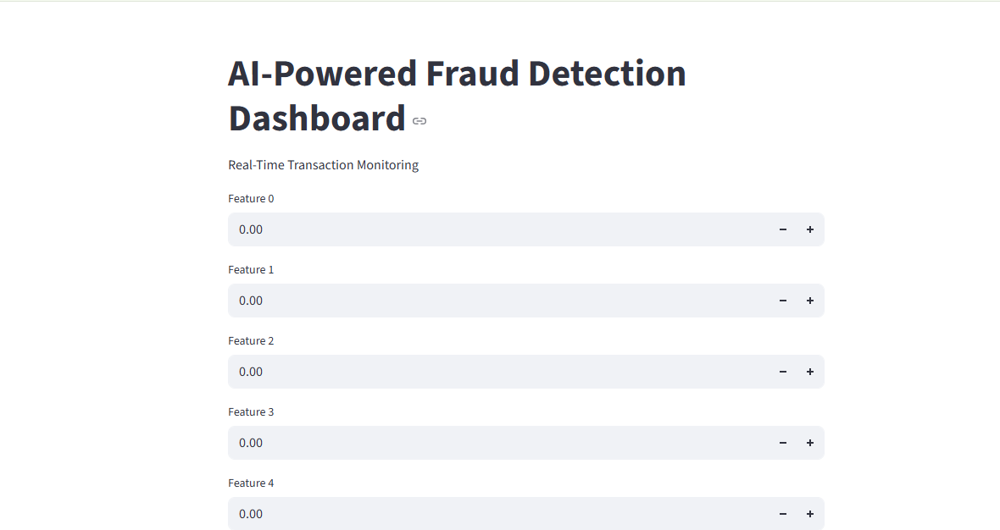

# AI Powered Fraud Detection System

## Project Overview
This project detects fraudulent credit card transactions using Machine Learning.  
The model analyzes transaction features and predicts whether a transaction is **Fraud** or **Normal**.

## Features
- Machine Learning fraud detection
- Random Forest classification model
- Real-time prediction dashboard
- Data visualization

## Technologies Used
- Python
- Pandas
- NumPy
- Scikit-learn
- Matplotlib
- Streamlit

## Project Structure
Fraud-Detection-System
│
├── app.py
├── model.py
├── train_model.py
├── predict.py
├── fraud_model.pkl
├── requirements.txt
└── README.md

## 📊 Dataset
The dataset used is the **Credit Card Fraud Detection Dataset**.

Download dataset here:
https://www.kaggle.com/datasets/mlg-ulb/creditcardfraud

## How to Run the Project

Install requirements:

pip install -r requirements.txt

Run the app:

streamlit run app.py

## Project Screenshot

## Author
Jonnakooti Ram Teja